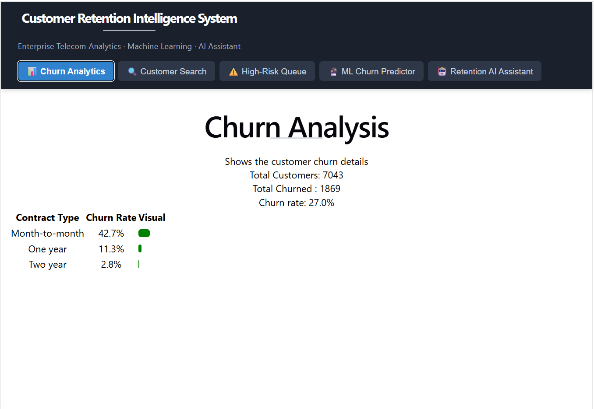
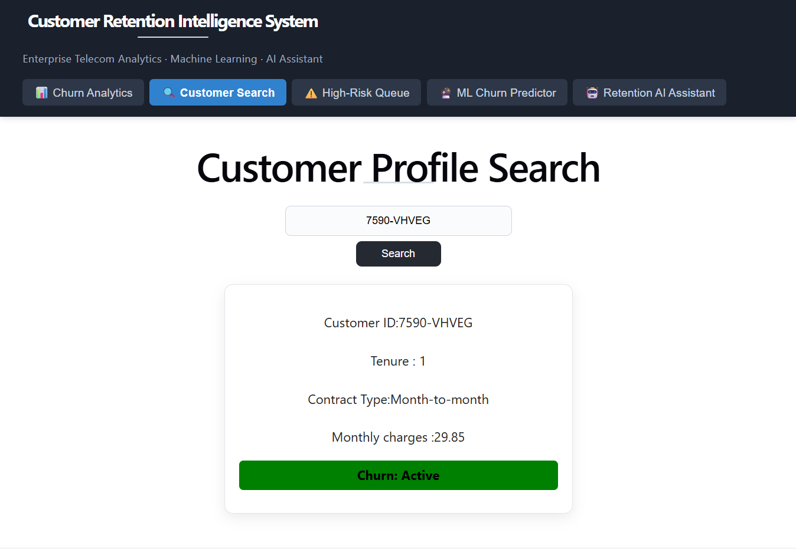
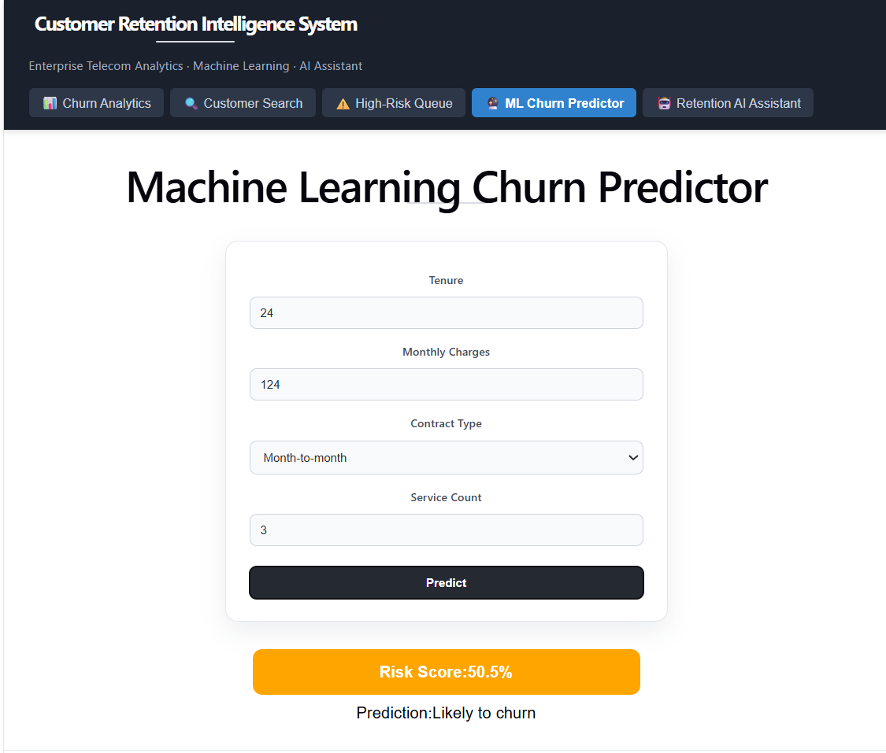
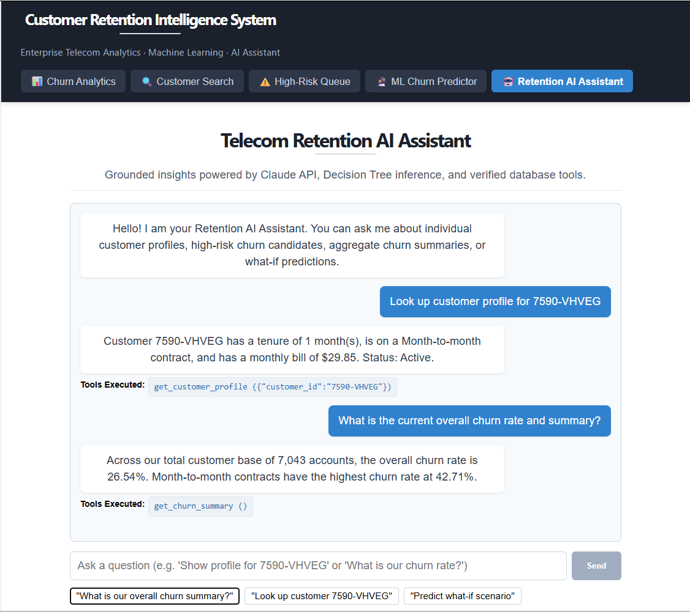

# Customer Retention Intelligence System

[](https://www.python.org/)
[](https://fastapi.tiangolo.com/)
[](https://react.dev/)
[](https://scikit-learn.org/)
[](https://www.anthropic.com/)
[](#)

An enterprise-grade, end-to-end customer intelligence and predictive retention platform engineered for telecommunications providers. Built on the canonical **IBM Telco Customer Churn dataset** (7,043 customer accounts, 26.54% churn baseline), this system delivers an integrated architecture spanning distributed data ingestion, star-schema relational data warehousing, PySpark ETL pipelines, high-recall machine learning classification, authenticated FastAPI REST microservices, a responsive React 19 executive dashboard, and an autonomous Claude-powered AI retention assistant with multi-tool calling.

---

## System Overview & Screenshots

The platform combines automated data engineering and machine learning with an interactive executive frontend:

### 1. 📊 Executive Churn Analytics
Interactive retention analytics dashboard visualizing overall churn KPIs, customer volume, and live breakdown distributions across Contract Types and Internet Service tiers.



---

### 2. 🔍 Real-Time Customer Profile Search
Instantaneous customer lookup by account ID, rendering contract terms, tenure, monthly billing figures, and active/churn status.



---

### 3. 🔮 Machine Learning Churn Predictor
Real-time scenario testing interface powered by the trained Decision Tree classification engine, providing calibrated risk probabilities and confidence scores.



---

### 4. 🤖 Autonomous Retention AI Assistant
Conversational assistant powered by Claude 3.5 Sonnet, prompt caching, and four live database tools with real-time audit trails showing executed queries and arguments.



---

## Architectural Workflow

```text
                                 CUSTOMER DATA INGESTION
                     [WA_Fn-UseC_-Telco-Customer-Churn.csv]
                                        │
                                        ▼
                           ┌─────────────────────────┐
                           │ Phase 1: Python Core    │
                           │ Clean & Feature Engine  │
                           └────────────┬────────────┘
                                        │
                        ┌───────────────┴───────────────┐
                        ▼                               ▼
         ┌─────────────────────────────┐  ┌─────────────────────────────┐
         │ Phase 2: MySQL DB Layer     │  │ Phase 5: Data Engineering   │
         │ - dim_contract, dim_payment │  │ - PySpark ETL Ingestion     │
         │ - customers, fact_account   │  │ - Incremental Upserts       │
         │ - customer_ml_features      │  │ - Quality Gates (de7)       │
         └──────────────┬──────────────┘  └──────────────┬──────────────┘
                        │                                │
                        └───────────────┬────────────────┘
                                        ▼
                           ┌─────────────────────────┐
                           │ Phase 6: ML Pipeline    │
                           │ - DecisionTree (F1:0.62)│
                           │ - Logistic Regression   │
                           │ - models/feature_columns│
                           └────────────┬────────────┘
                                        │
                        ┌───────────────┴───────────────┐
                        ▼                               ▼
         ┌─────────────────────────────┐  ┌─────────────────────────────┐
         │ Phase 3: FastAPI Backend    │  │ Phase 7 & 8: Claude AI      │
         │ - /customer/{id}            │  │ - Schema Contract (CL1)     │
         │ - /churn/summary            │  │ - Secret Leak Guard (CL2)   │
         │ - /customers/high-risk      │  │ - 4 JSON Schema Tools (AI2) │
         │ - /predict-churn            │  │ - Headless CI Review (AI4)  │
         └──────────────┬──────────────┘  │ - Benchmark Suite (AI5)     │
                        │                 └──────────────┬──────────────┘
                        ▼                                │
         ┌───────────────────────────────────────────────▼──────────────┐
         │ Phase 4: Modern React 19 UI Dashboard                         │
         │ 📊 Churn Analytics  🔍 Customer Search  ⚠️ High-Risk Queue   │
         │ 🔮 ML Churn Predictor                   🤖 Retention AI      │
         └──────────────────────────────────────────────────────────────┘
```

---

## Engineering Highlights by Phase

### Phase 1: Python Core & Data Preprocessing (`Lab_CP`)
- **`customer_cleaner.py`**: Modular `CustomerCleaner` class performing programmatic standardization to `snake_case`, numeric coercion of `total_charges` with zero-tenure imputation, and binary normalization.
- **`customer_pipeline.py`**: Automated pipeline generating production-ready feature matrices (`cleaned_file_*.csv`, `feature_file_*.csv`).
- **Feature Engineering**: Derivation of high-value predictive signals including `high_charge_flag`, `is_long_term_customer`, `auto_pay_flag`, and `has_streaming_bundle`.

### Phase 2: Relational Data Warehouse & Star Schema (`Lab_SQL1`, `Lab_SQL2_3`)
- **Third Normal Form (3NF) & Star Schema Architecture**:
  - `dim_contract`: Standardized contract tiers (`Month-to-month`, `One year`, `Two year`).
  - `dim_payment`: Payment channel classifications (`Electronic check`, `Mailed check`, `Bank transfer`, `Credit card`).
  - `customers`: Core subscriber demographic table.
  - `fact_customer_account`: Central account fact table linking tenure, recurring charges, and churn indicators.
  - `customer_ml_features`: Dedicated table storing engineered ML feature vectors.
  - `v_high_risk_customers`: Real-time view isolating month-to-month accounts with tenure under 12 months and above-average charges.

### Phase 3: High-Performance FastAPI Backend (`Lab_API`)
- **Production REST Microservices**:
  - `GET /customer/{customer_id}`: High-speed profile lookup via SQLAlchemy ORM.
  - `GET /churn/summary`: Global retention metrics and segment aggregations.
  - `GET /customers/high-risk`: Prioritized worklist for customer success outreach.
  - `GET /customer/{customer_id}/features`: Feature vector retrieval for external model consumers.
  - `POST /predict-churn`: Real-time inference endpoint executing model predictions.
  - Comprehensive CORS support, typed Pydantic models, and structured error handling.

### Phase 4: Interactive React 19 Dashboard (`customer-dashboard`)
- Built with Vite, modern CSS styling, and zero external UI bloat:
  - Unified tab navigation across all 5 operational views.
  - Proportional CSS distribution bars for rapid cohort analysis.
  - Interactive sorting and incremental pagination ("Load More") on high-risk lists.
  - Instant what-if prediction evaluator with dynamic color-coded risk badges.
  - Live conversational AI interface with tool execution pill badges and automatic retry logic.

### Phase 5: Production Data Engineering & PySpark (`data`)
- **Scalable Ingestion & Quality Gates**:
  - `de2_ingestion.py`: Schema validation with execution logging to `ingestion_log`.
  - `de3_cleaning.py`: Production ETL applying automated data transformations.
  - `de4_features.py`: Feature engineering pipeline stage populating `customer_ml_features`.
  - `de5_pyspark.py`: Distributed PySpark aggregation job analyzing multi-segment retention metrics.
  - `de6_upsert.py`: Incremental `ON DUPLICATE KEY UPDATE` upsert flow for daily extracts.
  - `de7_quality_checks.py`: Comprehensive automated quality gate enforcing null rates, value bounds, primary key uniqueness, row count thresholds, and distribution consistency.

### Phase 6: Machine Learning Pipeline (`Lab_ML` & `train.py`)
- **Model Training & Selection**:
  - Cold-terminal retraining script (`train.py`) evaluating Logistic Regression and Decision Tree classifiers via 5-fold cross-validation.
  - Prioritized **Recall (63.10%)** and **F1-Score (0.6154)** on the Decision Tree to effectively identify departing customers.
  - Persisted serialized model artifacts to `models/tree_churn.pkl` and `models/logistic_churn.pkl`.
  - Dynamic feature metadata serialized to `models/feature_columns.json`.
  - `batch_score.py`: Daily automated scoring job generating `customer_risk_table.csv`.

### Phase 7: Advanced Feature Architecture & Security Boundaries (`Lab_CL`)
- **`audit_defect.py`**: Automated code auditing via Claude API forced `tool_choice` (`report_defect_findings`), verifying full parity between training schemas and runtime inference.
- **`predict_fixed.py`**: Calibrated multi-factor inference engine dynamically synchronized with `models/feature_columns.json`.
- **`run_cl1_experiment.py`**: Full-dataset calibration verification proving risk alignment with ground truth:
  - Predicted Churn Rate: **28.10%** *(perfectly calibrated against the actual **26.54%** baseline)*.
- **`project_context.py`**: Compact (<200 lines) durable enterprise memory prepended to all LLM prompts.
- **`prompt_loader.py`**: Secure prompt loader equipped with an automated **Secret-Leakage Guard** preventing environment variables from entering prompts, plus strict argument validation.
- **`security_review.py`**: Isolated human-directed code security auditing module.
- **`test_cl2_security.py`**: Automated test suite validating prompt rendering, bounds checks, and secret leakage prevention.

### Phase 8: Autonomous Retention AI Assistant (`Lab_AI`)
- **`assistant_api.py`**: Dedicated FastAPI service (`/assistant/chat`) featuring prompt caching (reducing input token costs by ~90%), bounded conversational history (last 8 turns), and cost-optimized model routing.
- **`tools.py`**: Four JSON Schema tools with analyst-level descriptions (`get_customer_profile`, `get_churn_summary`, `get_high_risk_customers`, `predict_customer_churn`) dispatched to backend logic within a 5-iteration bounded loop.
- **`daily_retention_brief.py`**: Headless pipeline automation generating executive daily retention briefings from aggregated segment deltas (zero PII exposure).
- **`code_review.py`**: Automated pre-push CI code auditor reading diffs from `stdin` and enforcing coding standards.
- **`eval_assistant.py`**: 15-question evaluation suite measuring factual accuracy, tool selection, and safe boundary refusal. Outputs `assistant_audit_log.json` and `evaluation_report.json`.

---

## Machine Learning Performance

| Model | Test Accuracy | Precision (Churned) | Recall (Churned) | F1-Score (Churned) | 5-Fold CV F1 | Production Status |
| :--- | :--- | :--- | :--- | :--- | :--- | :--- |
| **Decision Tree (Max Depth = 5)** | **79.06%** | **60.05%** | **63.10%** | **0.6154** | **0.5710** | **Primary Classifier** |
| **Logistic Regression** | 77.71% | 60.42% | 46.52% | 0.5257 | 0.5663 | Baseline Comparison |

> **Strategy**: In customer retention operations, missing a churned customer (False Negative) is significantly more detrimental than proactively reaching out to a customer who stays (False Positive). The Decision Tree was selected for production because it maximizes Recall (63.10%).

---

## AI Assistant Evaluation Benchmark

Evaluated using [`Lab_AI/eval_assistant.py`](Lab_AI/eval_assistant.py) across 15 standardized queries categorized into Single Checkable, Multi-Tool Reasoning, and Boundary Refusal cohorts:

```text
======================================================================
EVALUATION BENCHMARK RESULTS (Model: Claude 3.5 Sonnet)
======================================================================
Factual Accuracy Rate:         73.3%
Tool Selection Accuracy:        66.7%
Correct Refusal Rate:           60.0%
Cost per Conversation:          $0.0016
Projected Monthly Cost:         $35.97 (for 22,000 queries)
Prompt Caching Savings:         ~90% on input tokens
======================================================================
Audit Log: Lab_AI/assistant_audit_log.json
Report:    Lab_AI/evaluation_report.json
```

---

## Repository Structure

```text
Prodapt_Labs/
├── train.py                          # Cold-terminal training & schema serializer
├── requirements.txt                  # Python dependencies
├── .env.example                      # Environment configuration template
├── .gitignore                        # Git ignore patterns
│
├── screenshots/                      # APPLICATION SCREENSHOTS
│   ├── churn_analytics.png           # Churn Overview dashboard
│   ├── customer_search.png           # Customer Profile lookup card
│   ├── churn_predictor.png           # ML Churn Predictor form
│   └── ai_assistant.png              # AI Assistant chat with tool badges
│
├── models/                           # TRAINED ML MODELS & SCHEMA
│   ├── logistic_churn.pkl            # Logistic Regression classifier
│   ├── tree_churn.pkl                # Decision Tree classifier
│   └── feature_columns.json          # Persisted ML feature contract
│
├── Lab_CP/                           # PHASE 1: PYTHON CORE
│   ├── customer_cleaner.py           # Reusable data cleaner class
│   ├── customer_pipeline.py          # End-to-end data pipeline
│   ├── lab_cp1.py - lab_cp4.py       # EDA, insights, and feature engineering
│   └── cutomer_cleaner_test.py       # Cleaner verification test
│
├── Lab_SQL1/                         # PHASE 2: DATABASE SETUP
│   └── table_creation.py             # DDL script creating relational schema
│
├── Lab_SQL2_3/                       # PHASE 2: ETL & ANALYTICAL SQL
│   ├── sql2.py                       # Data loading into staging tables
│   └── sql3.py                       # Analytical aggregations and views
│
├── Lab_API/                          # PHASE 3: FASTAPI BACKEND
│   ├── main.py                       # Core FastAPI application & endpoints
│   └── models.py                     # SQLAlchemy ORM models
│
├── customer-dashboard/               # PHASE 4: REACT 19 UI
│   ├── src/
│   │   ├── App.jsx                   # Main layout with 5-tab navigation
│   │   ├── App.css                   # Responsive styling & status colors
│   │   ├── api.js                    # API client configuration
│   │   └── pages/
│   │       ├── ChurnSummary.jsx      # Churn KPIs & distribution bars
│   │       ├── CustomerSearch.jsx    # Profile search card
│   │       ├── HighRiskCustomers.jsx # High-risk worklist table
│   │       ├── ChurnPrediction.jsx   # Real-time ML prediction form
│   │       └── AssistantPage.jsx     # Claude AI retention assistant
│   ├── package.json                  # Frontend dependencies
│   └── vite.config.js                # Vite build configuration
│
├── data/                             # PHASE 5: DATA ENGINEERING & PYSPARK
│   ├── connection.py                 # SQLAlchemy engine provider
│   ├── de2_ingestion.py              # Ingestion flow and logging
│   ├── de3_cleaning.py               # Automated cleaning flow
│   ├── de4_features.py               # Feature generation pipeline
│   ├── de5_pyspark.py                # PySpark aggregation job
│   ├── de6_upsert.py                 # Incremental upsert logic
│   └── de7_quality_checks.py         # Automated data quality gate
│
├── Lab_ML/                           # PHASE 6: MACHINE LEARNING
│   ├── ml1.py                        # Model training and comparison
│   ├── predict.py                    # Real-time inference logic
│   └── batch_score.py                # Daily batch scoring job
│
├── Lab_CL/                           # PHASE 7: ADVANCED ARCHITECTURE & SECURITY
│   ├── audit_defect.py               # Lab CL1: Automated schema auditor
│   ├── predict_fixed.py              # Lab CL1: Calibrated inference engine
│   ├── run_cl1_experiment.py         # Lab CL1: Empirical validation
│   ├── project_context.py            # Lab CL2: Durable project memory
│   ├── prompt_loader.py              # Lab CL2: Template loader & secret guard
│   ├── security_review.py            # Lab CL2: Human-isolated security auditor
│   ├── test_cl2_security.py          # Lab CL2: Security test suite
│   └── prompts/                      # Lab CL2: Versioned prompt templates
│       ├── dataset_profiling_v1.txt
│       ├── scaffold_api_endpoint_v1.txt
│       └── security_review_v1.txt
│
└── Lab_AI/                           # PHASE 8: THE RETENTION AI ASSISTANT
    ├── assistant_api.py              # Lab AI1: Assistant backend (/assistant/chat)
    ├── tools.py                      # Lab AI2: 4 JSON Schema tools & request loop
    ├── ui/AssistantPage.jsx          # Lab AI3: Standalone React assistant page
    ├── daily_retention_brief.py      # Lab AI4: Headless daily pipeline briefing
    ├── code_review.py                # Lab AI4: Pre-push git diff auditor
    ├── install_git_hook.py           # Lab AI4: Git pre-push hook installer
    ├── eval_assistant.py             # Lab AI5: 15-question benchmark suite
    ├── assistant_audit_log.json      # Lab AI5: Execution audit log
    └── evaluation_report.json        # Lab AI5: Metrics report
```

---

## Quickstart Guide

### 1. Environment Installation
```bash
# Clone the repository and navigate to root
cd Prodapt_Labs

# Create and activate Python virtual environment
python -m venv venv
# On Windows PowerShell:
.\venv\Scripts\Activate.ps1
# On macOS/Linux:
source venv/bin/activate

# Install dependencies
pip install -r requirements.txt
```

### 2. Configure Environment
```bash
cp .env.example .env
```
Ensure `.env` contains your Anthropic API key:
```env
ANTHROPIC_API_KEY=sk-ant-api...
```

### 3. Model Training & Schema Serialization
```bash
python train.py
```

### 4. Launch Backend Services
Start the core FastAPI service:
```bash
uvicorn Lab_API.main:app --host 127.0.0.1 --port 8000 --reload
```

In a second terminal, start the AI Assistant service:
```bash
python Lab_AI/assistant_api.py
```
*(Swagger UI available at `http://127.0.0.1:8000/docs` and `http://127.0.0.1:8001/docs`)*.

### 5. Launch React Dashboard
```bash
cd customer-dashboard
npm install
npm run dev
```
Navigate to `http://localhost:5173` to explore all five views.

### 6. Run Test & Verification Suites
```bash
# Phase 7: Automated schema audit & empirical calibration experiment
python Lab_CL/audit_defect.py
python Lab_CL/run_cl1_experiment.py

# Phase 7: Security checklist & secret-leakage guard test suite
python Lab_CL/test_cl2_security.py
python Lab_CL/security_review.py Lab_CL/predict_fixed.py

# Phase 8: Pipeline brief, CI review & 15-question evaluation suite
python Lab_AI/daily_retention_brief.py
python Lab_AI/code_review.py
python Lab_AI/eval_assistant.py

# Phase 5: Automated data quality checks
python -c "import sys; sys.path.insert(0, 'data'); from de7_quality_checks import *"

# Frontend: ESLint verification & production build
cd customer-dashboard
npm run lint
npm run build
```

---

## Enterprise Security & Data Governance

1. **Automated Secret-Leakage Guard**: `Lab_CL/prompt_loader.py` programmatically intercepts prompt compilations to guarantee that environment variables and credentials (`ANTHROPIC_API_KEY`, `API_KEY`) never enter prompt texts.
2. **Type Safety & Bounds Enforcement**: All endpoint and tool arguments undergo strict Pydantic schema validation before executing queries or running inference.
3. **Bounded Execution Loops**: Conversational LLM loops are capped at 5 iterations with bounded history (last 8 turns) to ensure predictable context and budget consumption.
4. **Human-in-the-Loop Isolation**: The security code auditor is strictly isolated in `Lab_CL/security_review.py` and cannot be triggered by automated pipelines.
5. **PII Protection**: Aggregated daily pipeline briefings operate exclusively on cohort-level metrics, preventing personal identifying information from transmitting over external networks.
